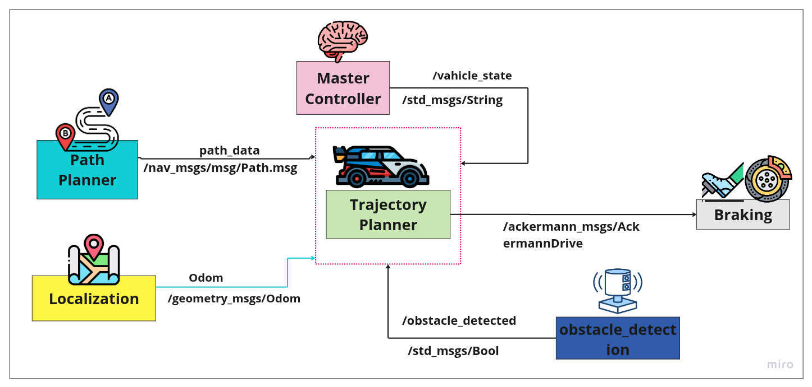
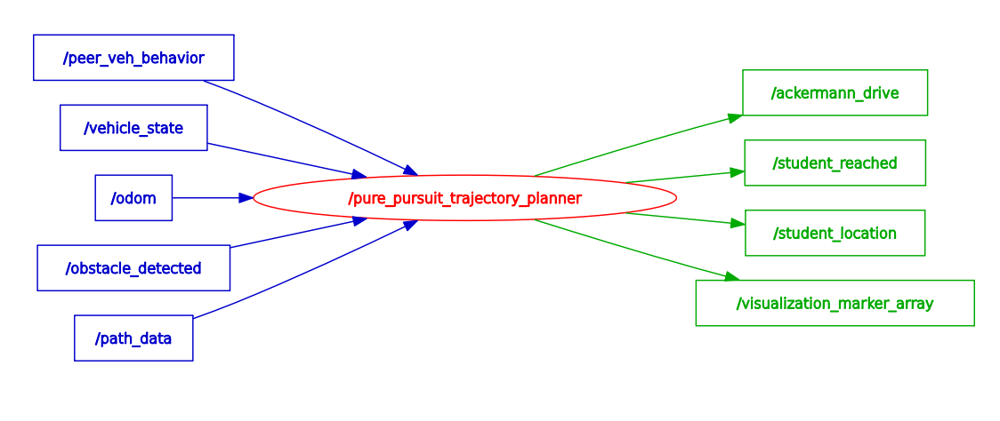

# Trajectory Planner

A ROS2 path and trajectory planning system for autonomous vehicle control. This package implements real-time trajectory planning with dual-mode control strategies—Pure Pursuit for standard path following and Dynamic Window Approach (DWA) for intelligent overtaking maneuvers.

<div align="center">
    
</div>

### Demo

Click on the thumbnail below to watch the full demonstration:

<div align="center">
    <a href="https://www.youtube.com/watch?v=_enGm8Vtt6A">
        
    </a>
</div>

This demo showcases the trajectory planner in action with real-time path following and autonomous overtaking maneuvers.

## Key Features

- **Dual-Mode Control**: Seamlessly switches between Pure Pursuit for standard route following and DWA for safe overtaking maneuvers
- **State-Managed Overtaking**: Four-phase state machine (`NORMAL_DRIVING`, `LANE_CHANGE_DEPARTURE`, `PASSING_PHASE`, `LANE_CHANGE_RETURN`) manages the complete overtaking process
- **Dynamic Speed Adaptation**: Adjusts vehicle speed based on path curvature—slowing for sharp turns, accelerating on straightaways
- **Safety System**: Emergency stop on obstacle detection, monitors vehicle state, maintains safe clearance distances
- **Path Optimization**: Continuously prunes waypoints behind the vehicle to reduce computational load
- **ROS2 Integration**: Full sensor integration with real-time visualization in RViz

## System Architecture

### Nodes

**TrajectoryPlanner Node** — Autonomous control component

#### Topic Interface

| Topic | Direction | Message Type | Description |
|-------|-----------|--------------|-------------|
| `/odom` | Input | `Odometry` | Current vehicle pose and velocity |
| `/path_data` | Input | `nav_msgs/Path` | Predefined path for the vehicle to follow |
| `/obstacle_detected` | Input | `std_msgs/Bool` | Obstacle detection signal |
| `/vehicle_state` | Input | `std_msgs/String` | Vehicle state: `Idle`, `Driving`, `Boarding`, `Drop-Off` |
| `/ackermann_drive_feedback` | Input | `AckermannDrive` | Actual speed and steering feedback |
| `/ackermann_drive` | Output | `AckermannDrive` | Target speed and steering commands |
| `/visualization_marker_array` | Output | `MarkerArray` | RViz visualization markers |
| `/student_location` | Output | `std_msgs/String` | Current student pickup/dropoff location |
| `/student_reached` | Output | `PoseStamped` | Student waypoint reached signal |

#### System Graph

<div align="center">
    
</div>

## Installation

### Prerequisites

- ROS2 (Humble or later)
- Python 3.10+
- `ackermann_msgs` package

### Setup

1. Clone the repository:
```bash
git clone https://github.com/rakeshsuthar6322/trajectory_planner.git
cd trajectory_planner
```

2. Build the package:
```bash
colcon build --packages-select tp_package
```

3. Source the workspace:
```bash
source install/setup.bash
```

## Usage

### Running the Planner

```bash
ros2 run tp_package tp_planner
```

The node will start listening for sensor inputs and publishing control commands. Ensure all required input topics (`/odom`, `/path_data`) are actively publishing data.

### Configuration Parameters

Key tuning parameters in `tp_planner.py`:

```python
self.min_speed = 0.3                              # Minimum vehicle speed (m/s)
self.max_speed = 0.4                              # Maximum vehicle speed (m/s)
self.lookahead_distance = 0.7                     # Pure Pursuit lookahead (m)
self.wheelbase = 0.50                             # Vehicle wheelbase (m)
self.steering_smoothing_factor = 0.2              # Steering command smoothing

# Overtaking parameters
self.overtake_trigger_distance = 1.50             # Distance to trigger overtaking (m)
self.overtake_target_lateral_offset = 0.35        # Lateral offset during pass (m)
self.overtake_cruising_length = 3.0               # Min distance alongside obstacle (m)
```

## Testing

### Unit Tests

Run unit tests to verify core algorithms:

```bash
colcon test --packages-select tp_package
```

### Integration Tests

Run integration tests with simulated sensor data:

```bash
colcon test --packages-select tp_package --ctest-args -R integration
```

Test coverage includes:
- Pure Pursuit steering computation
- DWA trajectory evaluation
- Overtaking state transitions
- Emergency stop behavior
- Smooth steering transitions

## Requirements

### User Stories

**C1.3** — As a trajectory planner component, detect static vehicles in the path and perform safe overtaking maneuvers to continue on the planned route without stopping.

**C1.4** — As a developer, ensure the trajectory planner dynamically switches control algorithms and provides clear status updates for monitoring vehicle behavior across different road conditions.

### Acceptance Criteria

| ID | Requirement |
|:---|:-----------|
| AC1 | Detect stationary obstacles within ego vehicle's path when distance ≤ 1.5 meters (overtake_trigger_distance) |
| AC2 | Set `is_overtaking = True` and transition `current_overtake_phase` from `NORMAL_DRIVING` → `LANE_CHANGE_DEPARTURE` upon obstacle detection |
| AC3 | Generate DWA trajectory steering vehicle to safe lateral offset (0.35m) and maintain for ≥3.0m cruising distance |
| AC4 | Transition to `LANE_CHANGE_RETURN` after cruising distance met; generate trajectory to safely merge back to original path |
| AC5 | Reset `is_overtaking = False` and return to `NORMAL_DRIVING` once obstacle cleared and path merge complete |
| AC6 | Publish Ackermann drive commands to ROS2 terminal |
| AC7 | Use Pure Pursuit for normal driving; DWA exclusively for overtaking maneuvers |
| AC8 | Stop immediately (speed = 0) and log warning if obstacle detected or vehicle state ≠ "Driving" |
| AC9 | Log "Ready to Drive" only when `/odom` and `/path_data` actively received; log "Waiting for essential input" if inputs unavailable >1s; publish halt command |
| AC10 | Ensure smooth speed and steering transitions without jerky/sudden changes between control algorithm switches |

## Control Algorithms

### Pure Pursuit

Standard path-tracking algorithm that:
- Computes steering angle to reach a lookahead point on the path
- Adapts speed based on path curvature for stable turns
- Maintains smooth trajectory for normal driving

### Dynamic Window Approach (DWA)

Advanced maneuver planning used exclusively for overtaking:
- Samples velocity and angular velocity combinations
- Evaluates trajectories using a cost function balancing:
  - Target following (reaching the desired lateral offset)
  - Collision avoidance
  - Path adherence
- Selects the optimal trajectory while maintaining vehicle dynamics constraints

## Overtaking State Machine

The system uses a four-phase state machine for safe overtaking:

1. **NORMAL_DRIVING** — Standard Pure Pursuit path following
2. **LANE_CHANGE_DEPARTURE** — DWA-based lateral movement to safe offset distance
3. **PASSING_PHASE** — Cruising alongside obstacle while maintaining lateral offset
4. **LANE_CHANGE_RETURN** — DWA-based merge back to the original path

State transitions occur automatically based on:
- Obstacle proximity (≤1.5m triggers departure)
- Cruising distance (≥3.0m triggers return phase)
- Path alignment (successful merge returns to normal driving)

## Safety Features

- **Emergency Stop**: Immediate halt on `/obstacle_detected` signal or non-Driving vehicle state
- **Sensor Validation**: Waits for valid `/odom` and `/path_data` inputs before operation
- **Smooth Transitions**: Steering and speed commands transition gradually to avoid jerky vehicle behavior
- **Clearance Enforcement**: Maintains safe distance from obstacles during all maneuvers

> **Warning:** This is autonomous vehicle control code. Always test in simulation first, then in controlled environments before autonomous deployment.

## Contributing

See [CONTRIBUTING.md](CONTRIBUTING.md) for guidelines.

## License

This project is licensed under the Apache 2.0 License. See [LICENSE](LICENSE) for details.

## Maintainer

**Rakesh Suthar** — [@rakeshsuthar6322](https://github.com/rakeshsuthar6322)
