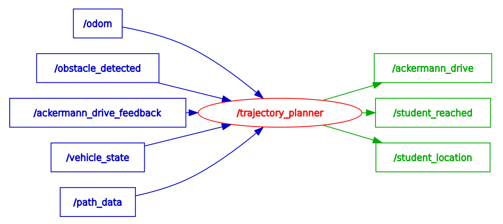

# Trajectory Planner
ROS2 path and trajectory planner repository(Team Elite).

## Main Contributor
Sachin ([@ann2716s](https://git.hs-coburg.de/ann2716s))

## Component Description

The TrajectoryPlanner component is responsible for autonomously controlling a vehicle along a predefined path using Ackermann driving commands. It operates in real-time to process sensor inputs, evaluate the driving environment, and issue drive commands accordingly.

---

<div align="center">
    
</div>

---

## Table of Contents
- [Nodes](#nodes)
- [RQT_graph](#rqt_graph)
- [Installation](#installation)
- [Usage](#usage)
- [Testing](#testing)
- [License](#license)


## Nodes
### Node: `path and trajectory Planner`
#### Topics

### 🧾 TrajectoryPlanner – Topic Interface Table

| **Topic**                   | **Input/Output** | **Message Type**               | *Description**                                                  |
|----------------------------|---------|---------------------------------|------------------------------------------------------------------|
| `/odom`                    | Input   | `geometry_msgs/TwistStamped`    | Current pose and orientation.             |
| `/path_data`               | Input   | `nav_msgs/Path`                 | Path that the vehicle is expected to follow.                     |
| `/obstacle_detected`       | Input   | `std_msgs/Bool`                 | Signals if an obstacle is detected in the path.                  |
| `/vehicle_state`           | Input   | `std_msgs/String`               | Vehicle state: "Idle","Driving","Boarding","Drop-Off"            |
| `/ackermann_drive_feedback`| Input   | `ackermann_msgs/AckermannDrive` | Feedback of actual speed and steering.                           |
| `/ackermann_drive`         | Output  | `ackermann_msgs/AckermannDrive` | Publishes target speed and steering to control the vehicle.      |

## RQT_graph
---
<div align="center">
    
</div>
---

## Trajectory Planner Component

### User Story

---

1.2 As a trajectory planner component, I want to receive a sequence of path waypoints (generated by the path planner), And compute trajectory that publishes Ackermann drive commands under the topic Ackermann_drive containing speed and steering angle. So that the ego-vehicle can 
follow the curved path accurately and stop at designated locations.

---

### Acceptance Criteria

---

AC1: Given the trajectory planner is executing the control loop, When required inputs (ego_pose, ego_twist, path) are not available, Then the planner must skip motion command publishing. Issue a single warning log about missing inputs.

AC2: If obstacle_detected is True, the trajectory planner must publish an Ackermann_drive message with speed = 0 and steering_angle = 0 to stop the vehicle immediately.

AC3: If the vehicle_state is not "Driving", the trajectory planner must publish an Ackermann_drive message with speed = 0 and steering_angle = 0 to stop the vehicle immediately.

AC4: The trajectory planner component must dynamically adjust the vehicle's speed based on the computed steering angle, such that sharper steering results in lower speeds and smaller steering angles allow higher speeds. The speed must always remain within the range defined by min_speed and max_speed.

AC5: When the vehicle has reached the endpoint of the path, the trajectory planner component must publish an Ackermann_drive message with speed = 0 and steering_angle = 0 to stop the vehicle immediately.

AC6: The trajectory planner component should print Ackermann_drive commands in the ROS2 terminal.

---

## Installation
1. Clone the repository:
```bash
 git clone https://git.hs-coburg.de/Team_ELITE/EL_Path_Planner.git
```
2. Build the package:
```bash
 colcon build --packages-select tp_package
```
3. Source the workspace:
```bash
 source install/setup.bash
```

## Usage
### Launching the Nodes
To launch all of the nodes in lateral control package, run the following command:

```bash
ros2 run tp_package tp_planner 
```

## Testing
### Unit Tests
To run the unit tests for this package, use the following command:

```bash
colcon test --packages-select tj_planner
```

## License

This project is licensed under the **Apache 2.0 License** - see the [LICENSE](LICENSE) file for details.