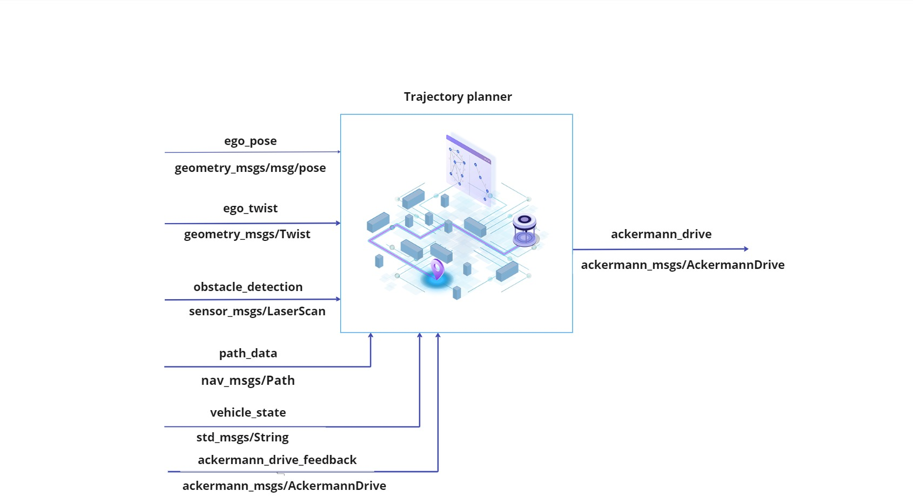
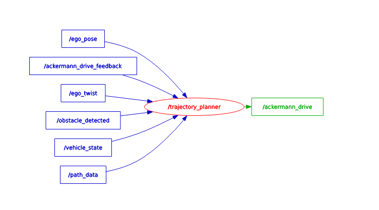

# Trajectory Planner
ROS2 path and trajectory planner repository(Team Elite).

## Main Contributor
Sachin ([@ann2716s](https://git.hs-coburg.de/ann2716s))

## Component Description

The TrajectoryPlanner component is responsible for autonomously controlling a vehicle along a predefined path using Ackermann steering. It operates in real-time to process sensor inputs, evaluate the driving environment, and issue drive commands accordingly.

---

<div align="center">
    
</div>

---

## Table of Contents
- [Nodes](#nodes)
- [RQT_graph](#rqt_graph)
- [Installation](#installation)
- [Usage](#usage)
- [Testing](#testing)
- [License](#license)


## Nodes
### Node: `path and trajectory Planner`
#### Topics

### 🧾 TrajectoryPlanner – Topic Interface Table

| **Topic**                   | **Input/Output** | **Message Type**               | *Description**                                                  |
|----------------------------|---------|---------------------------------|------------------------------------------------------------------|
| `/ego_pose`                | Input   | `geometry_msgs/PoseStamped`     | Current position and orientation of the vehicle.                 |
| `/ego_twist`               | Input   | `geometry_msgs/TwistStamped`    | Current velocity (linear & angular) of the vehicle.              |
| `/path_data`               | Input   | `nav_msgs/Path`                 | Path that the vehicle is expected to follow.                     |
| `/obstacle_detected`       | Input   | `std_msgs/Bool`                 | Signals if an obstacle is detected in the path.                  |
| `/vehicle_state`           | Input   | `std_msgs/String`               | Vehicle state: "Idle","Driving","Boarding","Drop-Off"            |
| `/ackermann_drive_feedback`| Input   | `ackermann_msgs/AckermannDrive` | Feedback of actual speed and steering.                           |
| `/ackermann_drive`         | Output  | `ackermann_msgs/AckermannDrive` | Publishes target speed and steering to control the vehicle.      |

## RQT_graph
---
<div align="center">
    
</div>
---


## Installation
1. Clone the repository:
```bash
 git clone https://git.hs-coburg.de/Team_ELITE/EL_Path_Planner.git
```
2. Build the package:
```bash
 colcon build --packages-select tp_package
```
3. Source the workspace:
```bash
 source install/setup.bash
```

## Usage
### Launching the Nodes
To launch all of the nodes in lateral control package, run the following command:

```bash
ros2 run tp_package tp_planner 
```

## Testing
### Unit Tests
To run the unit tests for this package, use the following command:

```bash
colcon test --packages-select tj_planner
```

## License

This project is licensed under the **Apache 2.0 License** - see the [LICENSE](LICENSE) file for details.