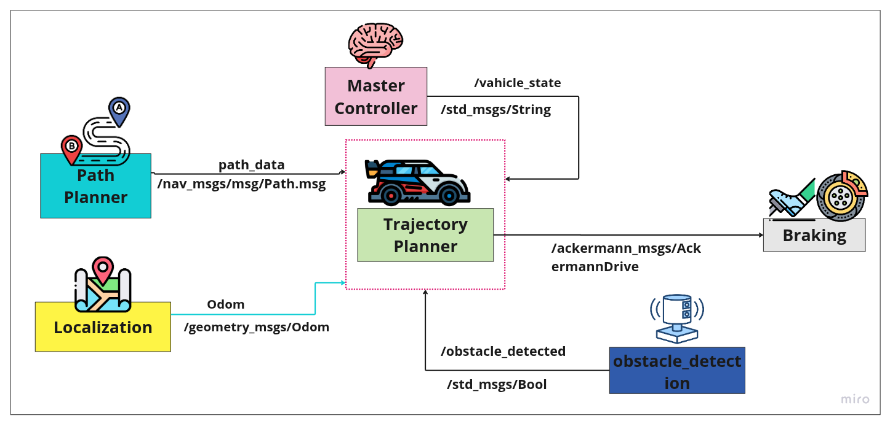
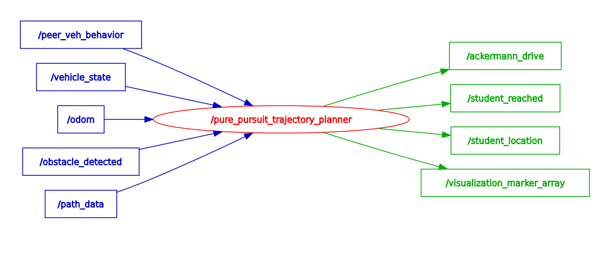

# Trajectory Planner
ROS2 path and trajectory planner repository(Team Elite).

## Main Contributor
Rakesh Suthar ([@rakeshsuthar6322](https://github.com/rakeshsuthar6322))

## Component Description

The TrajectoryPlanner component is responsible for autonomously controlling a vehicle along a predefined path using Ackermann driving commands. It operates in real-time by processing sensor inputs such as the vehicle's current pose, a predefined path, and obstacle detection signals. This component dynamically switches between two control algorithms: Pure Pursuit for standard path following and a Dynamic Window Approach (DWA) for complex maneuvers like overtaking static obstacles. Based on the driving environment and vehicle state, it computes and publishes a trajectory that includes target speed and steering angle, ensuring the vehicle can follow curved paths, perform safe overtaking maneuvers, and stop at designated locations or in emergency situations.

---

<div align="center">
    
</div>

---

## Table of Contents
- [Key Features](#Features)
- [Nodes](#nodes)
- [RQT_graph](#rqt_graph)
- [Installation](#installation)
- [Usage](#usage)
- [Testing](#testing)
- [License](#license)

---

## ✨ Key Features

* **Dual-Mode Control Strategy**: Seamlessly transitions between **Pure Pursuit** for standard route following and the **Dynamic Window Approach (DWA)** for executing safe overtaking maneuvers.

* **State-Managed Overtaking**: Employs a four-phase state machine (`NORMAL_DRIVING`, `LANE_CHANGE_DEPARTURE`, `PASSING_PHASE`, `LANE_CHANGE_RETURN`) to manage the entire overtaking process. DWA evaluates trajectories using a cost function that balances target-following, collision avoidance, and path adherence.

* **Dynamic Speed Adaptation**: In Pure Pursuit mode, the vehicle's speed is intelligently adjusted based on the path's curvature—slowing down for sharp turns and accelerating on straightaways to ensure stability.

* **Robust Safety System**: Listens for an `/obstacle_detected` signal to bring the vehicle to an immediate stop. It also halts if the overall `/vehicle_state` is not "Driving" and ensures a safe clearance distance is maintained during all maneuvers.

* **Efficient Path Management**: Continuously prunes the received path, discarding waypoints behind the vehicle to reduce computational load and improve focus on the upcoming trajectory.

* **ROS2 Integration & Visualization**: Publishes `AckermannDrive` commands, subscribes to essential sensor and state data, and publishes `visualization_msgs/Marker` messages to RViz for real-time monitoring of ego and peer vehicles.

---

## Nodes
### Node: `path and trajectory Planner`
#### Topics

### 🧾 TrajectoryPlanner – Topic Interface Table

| **Topic**                   | **Input/Output** | **Message Type**               | *Description**                                                  |
|----------------------------|---------|---------------------------------|------------------------------------------------------------------|
| `/odom`                    | Input   | `geometry_msgs/TwistStamped`    | Current pose and orientation.             |
| `/path_data`               | Input   | `nav_msgs/Path`                 | Path that the vehicle is expected to follow.                     |
| `/obstacle_detected`       | Input   | `std_msgs/Bool`                 | Signals if an obstacle is detected in the path.                  |
| `/vehicle_state`           | Input   | `std_msgs/String`               | Vehicle state: "Idle","Driving","Boarding","Drop-Off"            |
| `/ackermann_drive_feedback`| Input   | `ackermann_msgs/AckermannDrive` | Feedback of actual speed and steering.                           |
| `/ackermann_drive`         | Output  | `ackermann_msgs/AckermannDrive` | Publishes target speed and steering to control the vehicle.      |

## RQT_graph
---
<div align="center">
    
</div>
---

## Trajectory Planner Component

### User Story

---

C1.3 As a trajectory planner component, I want to detect a static vehicle in my path and perform a safe overtaking maneuver, so that I can continue my planned route without stopping and waiting for the vehicle to move.

C1.4 As a developer, I want the trajectory planner to dynamically switch control algorithms and provide clear status updates, so that I can monitor the vehicle's behavior and ensure it is responding correctly to different road conditions and states.

---

### Acceptance Criteria

---

AC1: The system must detect a stationary obstacle within the ego vehicle's path, specifically when the obstacle's distance is less than or equal to overtake_trigger_distance (1.5 meters).

AC2: Upon detecting the obstacle, the is_overtaking flag must be set to True, and the current_overtake_phase must transition from NORMAL_DRIVING to LANE_CHANGE_DEPARTURE.

AC3: The system must generate a DWA-based trajectory that steers the vehicle laterally to a safe distance from the obstacle (based on overtake_target_lateral_offset and overtake_safety_gap) and maintains this offset for a distance greater than or equal to overtake_cruising_length (3.0 meters).

AC4: Once the ego vehicle has successfully passed the obstacle, the current_overtake_phase must transition to LANE_CHANGE_RETURN. The system must then generate a trajectory that safely merges the vehicle back to the original planned path.

AC5: When the ego vehicle has successfully merged back onto the path and the obstacle is no longer a factor, the is_overtaking flag must be set back to False, and the current_overtake_phase must return to NORMAL_DRIVING.

AC6: The trajectory planner component should print Ackermann_drive commands in the ROS2 terminal.

AC7: The system must use the Pure Pursuit algorithm for normal driving and the DWA algorithm exclusively for overtaking maneuvers.

AC8: The vehicle must come to a full stop (speed = 0) and log a warning message if an obstacle is detected (obstacle_detected == True) or the vehicle state is not Driving.

AC9: The system must log a "Ready to Drive" message only when all required initial sensor inputs (/odom, /path_data) are actively being received. If any critical input becomes unavailable for more than 1 second, the system must log a "Waiting for essential input data" warning and publish a halt command.

AC10: When the control algorithm switches (e.g., from Pure Pursuit to DWA, or upon resuming from a halt), the commanded speed and steering_angle must transition smoothly, without sudden, large, or jerky changes in consecutive commands.

---

## Installation
1. Clone the repository:
```bash
 git clone https://github.com/rakeshsuthar6322/trajectory_planner.git
```
2. Build the package:
```bash
 colcon build --packages-select tp_package
```
3. Source the workspace:
```bash
 source install/setup.bash
```

## Usage
### Launching the Nodes
To launch all of the nodes in lateral control package, run the following command:

```bash
ros2 run tp_package tp_planner 
```

## Testing
### Unit Tests
To run the unit tests for this package, use the following command:

```bash
colcon test --packages-select tj_planner
```

## License

This project is licensed under the **Apache 2.0 License** - see the [LICENSE](LICENSE) file for details.
